# NETWORK MONITORING

## Zabbix

Zabbix is an open-source network monitoring tool that monitors:
- Networks, servers, applications, logs, security events, and cloud infrastructure

The tool monitors network devices via SNMP:

- Interface traffic, errors, CPU load, link status, device uptime, and bandwidth usage

On servers and host operating systems via agent, it monitors:

- CPU, RAM, disk, event logs, services, processes, and logs

Zabbix can also trigger alerts when:

- Packet drops increase, interface floods occur, or CPU usage spikes

### Core Problems Solved by Zabbix

1. "We don't know when a system fails"

    - continuously checks device status
    - detects outages automatically
    - alerts immediately

2. "We don't know why performance is slow"

    - collects performance metrics
    - shows trends
    - identifies bottlenecks

3. "We don't have visibility across infrastructure"

    Provides centralised monitoring for routers, switches, servers, applications, services, and logs.

4. "We can't detect abnormal behaviour early"

    - establishes normal baselines
    - detects deviations
    - triggers alerts

5. "Troubleshooting takes too long"

    Provides historical metrics:
    - bandwidth graphs
    - CPU usage graphs
    - service uptime logs

6. "We can't measure reliability or SLA"

    Zabbix calculates uptime percentages and availability reports for SLA compliance, audits, and management reports.

### SNMP

Simple Network Management Protocol (SNMP) is an application layer protocol used for monitoring, managing, and querying network devices such as routers, switches, servers, firewalls, printers, and IoT endpoints.

It enables a centralised system to:
- collect operational metrics
- detect faults
- trigger alerts
- modify device parameters remotely

SNMP communication types:

GET -> SET -> TRAP

Example:

- Zabbix sends a GET request to a router.
- The router checks its MIB and replies with the OID value for interface status.
- The router can also send a TRAP event such as "Interface Down."

I implemented Zabbix in my home lab.

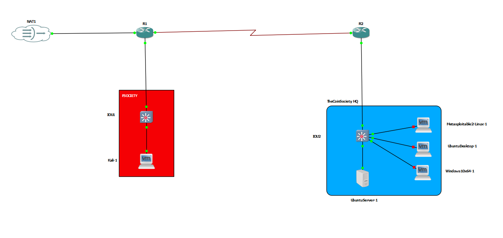

Reference: `https://www.zabbix.com/documentation/7.4/en/manual/installation/install_from_packages`

### Zabbix Installation

I ran the Zabbix server on UbuntuServer-1 for TheCoinSociety infrastructure (an imaginary company). To make installation and configuration easier, I accessed UbuntuServer-1 remotely from UbuntuDesktop-1 via SSH.

According to the official website, I first selected the OS hosting the Zabbix server so I could get the correct installation procedure.

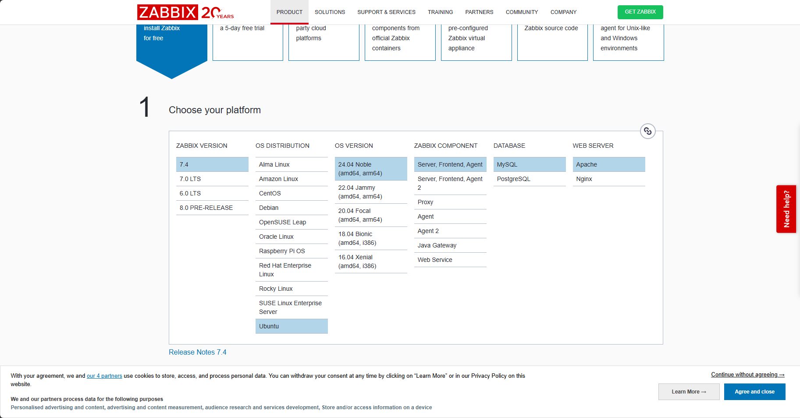

I then followed the process accordingly.

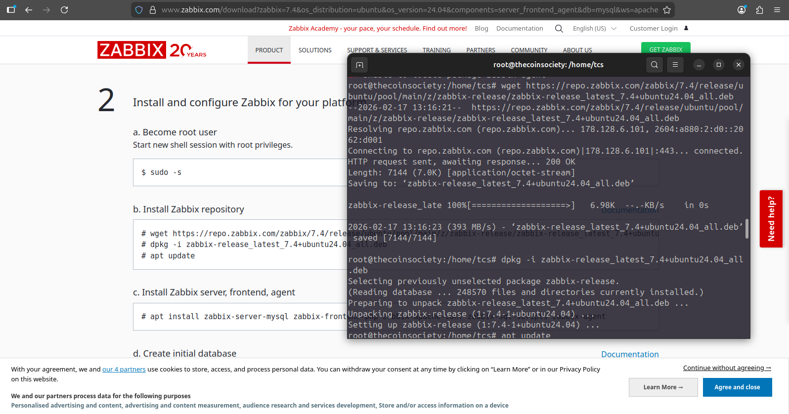

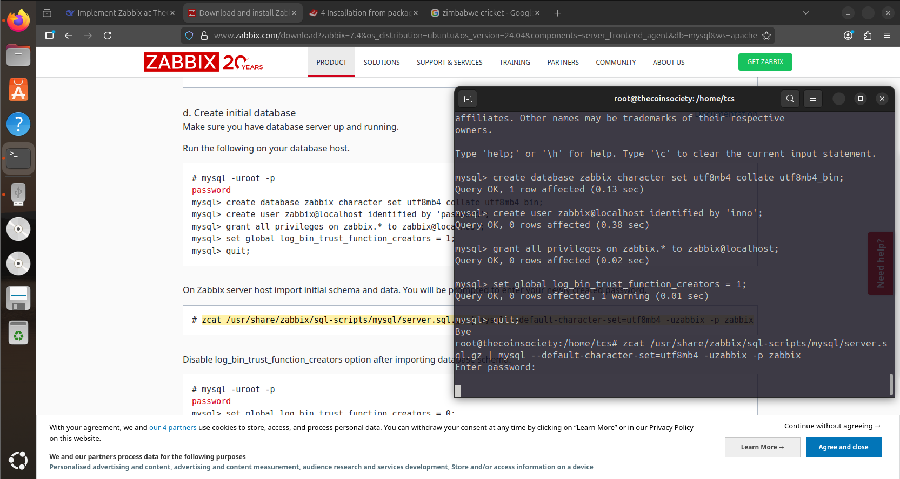

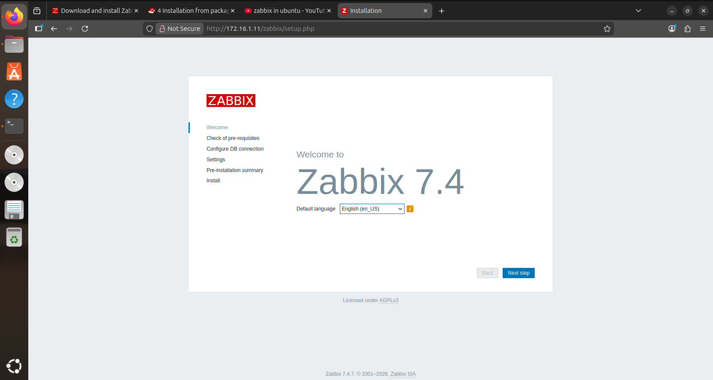

Zabbix Server was successfully installed and was running as a service on Ubuntu Server. It was accessible via the server IP `172.16.1.11/zabbix` (statically assigned).

On UbuntuServer-1, Zabbix ran as both a server and an agent.

This was the Zabbix dashboard.

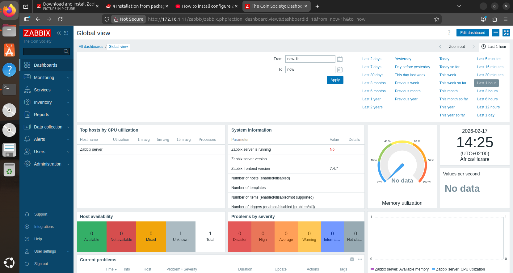

I configured network devices with SNMPv2 so Zabbix could poll their metrics, and I also added agents on Windows and Ubuntu Desktop.

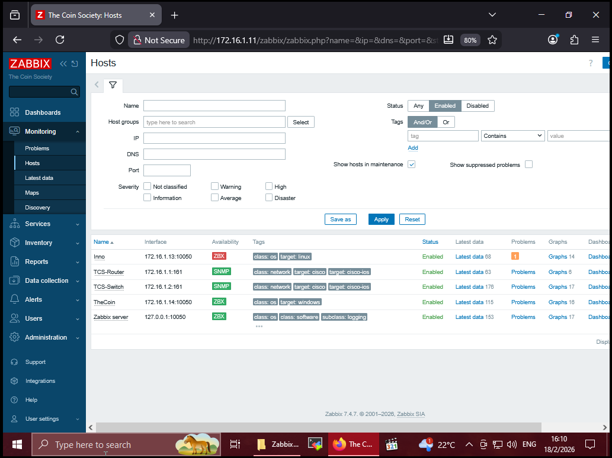
The devices were added to Zabbix for monitoring. The device named `Inno` was an Ubuntu Desktop host, which I turned off to save RAM usage.

To test monitoring on a network device, I shut down `interface serial 3/0` on TCS-Router.

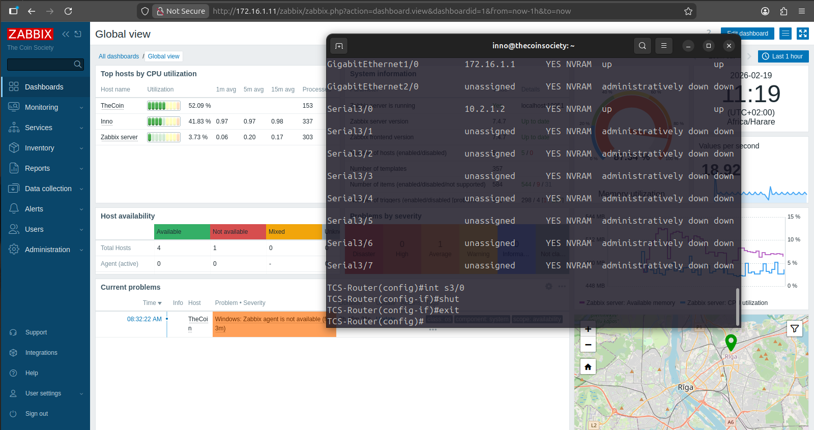

As shown below, it worked and provided downtime information for the serial interface

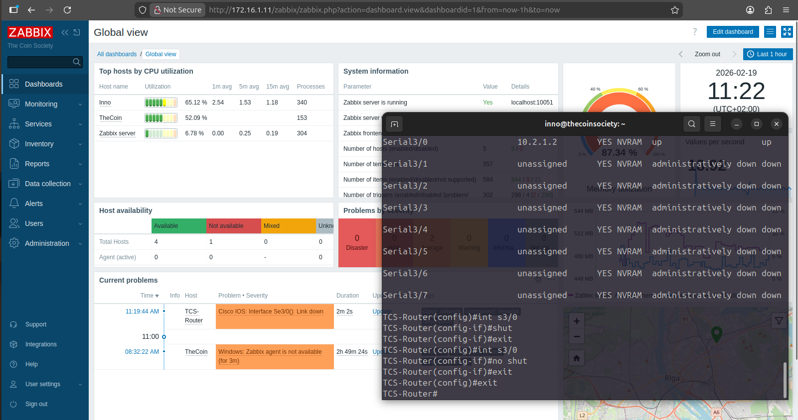

When I brought the interface back up, the issue was marked as resolved.

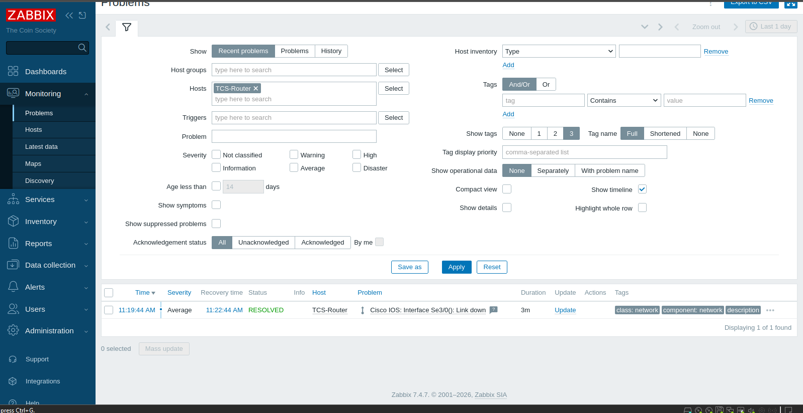

I also visualised traffic on an interface of a network device. Below is the traffic graph for `int g1/0`.

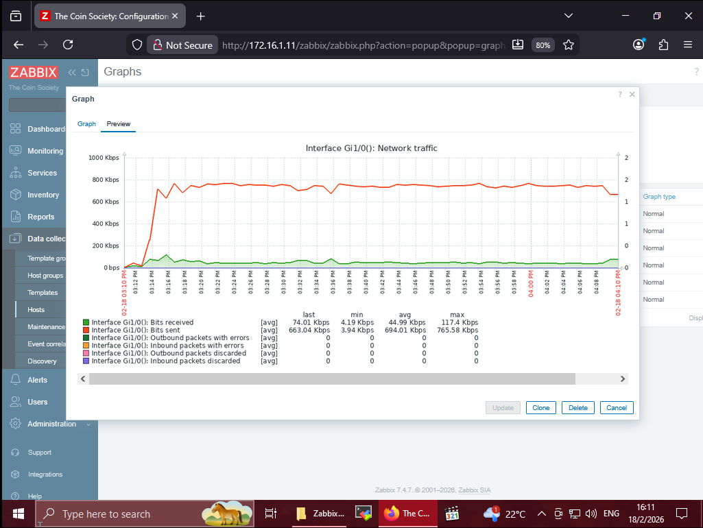
